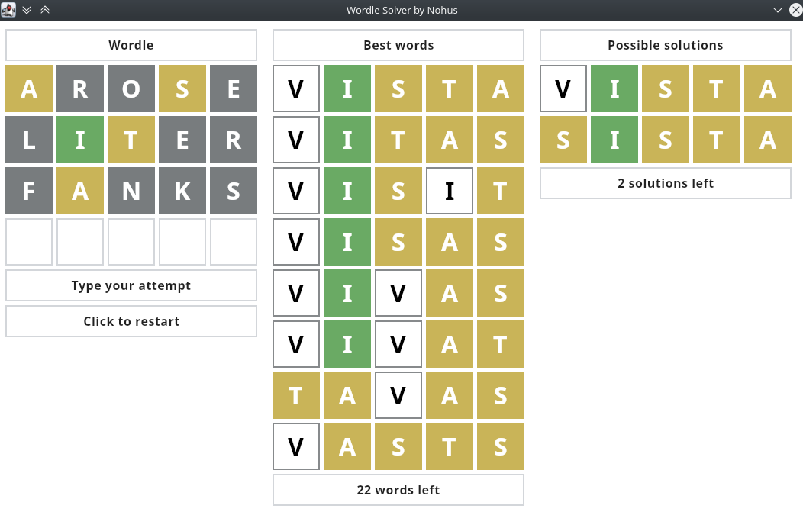

# WordleSolver
[Wordle](https://www.powerlanguage.co.uk/wordle/) solving application made with [Compose for Desktop](https://www.jetbrains.com/lp/compose-desktop/).

# Screenshot

# Video
https://streamable.com/uygzm3

# Why?
The purpose of this project was to have some fun creating the solution finding code and try out Compose for Desktop.
There is no point in actually using it to cheat at Wordle.
